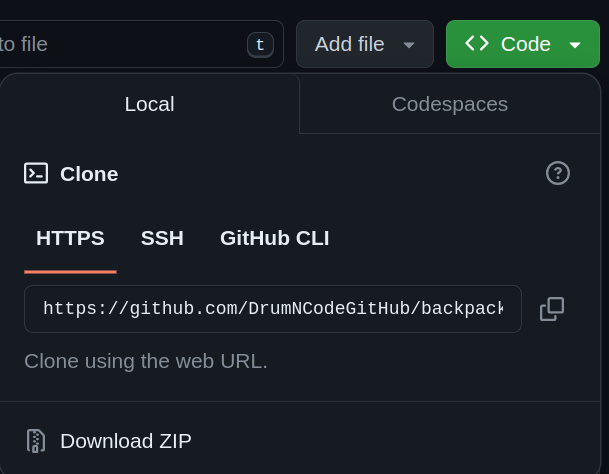

# Project is deployed on Netlify

[DEMO - BackPack Project](https://main--delicate-dusk-5c7d1f.netlify.app/)

# Getting Started with Create React App

This project was bootstrapped with [Create React App](https://github.com/facebook/create-react-app).

## To open project locally 
1. Fork this repository
2. Find the link to clone the project
3. Copy HTTPS link
4. Open Terminal and enter your project folder <code>cd /{your-project-folder}</code>
5. Enter <code>git clone {your-HTTPS-link}</code>
6. The project will be automatically added to your folder
7. Open project folder with your code editor
8. Run 
### `npm install`
and
### `npm start`

It will run the app in the development mode.\
Open [http://localhost:3000](http://localhost:3000) to view it in the browser.

## Learn More

You can learn more in the [Create React App documentation](https://facebook.github.io/create-react-app/docs/getting-started).

To learn React, check out the [React documentation](https://reactjs.org/).
